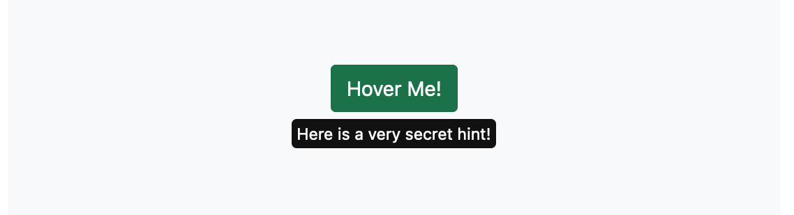

# svelte-hint

Svelte library for tooltips internally powered by the awesome [Popper.js](https://popper.js.org/) with sensible default values.

Check out the **[demo](https://svelte-hint.pages.dev/)** to see it in action.



## 🌈 Features

- Automatic positioning & overflow handling on screen edges.
- Fully typed.
- Sensible default values.
- Use text or custom html/components as tooltips.

## 📀 Installation

```bash
npm install svelte-hint
```

## ⌨️ Usage

### With text

```svelte
<script lang="ts">
  import { Hint } from 'svelte-hint'
</script>

<Hint text="A tooltip!">
  <button class="btn btn-success drag">Hover me!</button>
</Hint>
```

### With custom html / components

```svelte
<script lang="ts">
  import { Hint } from 'svelte-hint'
</script>

<Hint>
  <button class="btn btn-success drag">Hover me!</button>
  <i slot="hint">Some custom html</i>
</Hint>
```

## 🗂 Docs

### Props

| Prop        | Type                    | Default             | Description                                                                                           |
| ----------- | ----------------------- | ------------------- | ----------------------------------------------------------------------------------------------------- |
| `placement` | `Placement`             | `auto`              | For possible values see [popper](https://popper.js.org/docs/v2/constructors/#options).                |
| `text`      | `string`                | `''`                | Text to be used as the tooltip. If empty the slot will be used.                                       |
| `boundary`  | `HTMLElement \| string` | `'clippingParents'` | See [popper docs](https://popper.js.org/docs/v2/utils/detect-overflow/#boundary) for possible values. |
| `offset`    | `number`                | `4`                 | The offset is the distance that the tooltip gets positioned from the trigger.                         |

### Slots

#### `hint`

> Only works if the `text` props is empty. Otherwise the slot is ignored.

If you don't want to use the pre-styled tooltip you are free to use whatever html / svelte code you'd like as the tooltip.

```svelte
<Hint>
  <div>Hover me</div>
  <div slot="hint">Some custom html</div>
</Hint>
```
